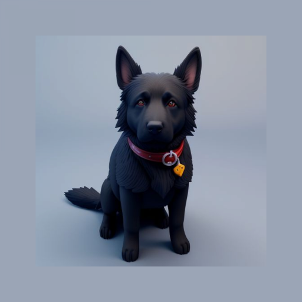

# Blacky

## Overview
Just a black app written in Flutter. Thanks to OLED, black pixels do not consume energy on smartphones. This can be used to use Blacky to
black 1/3, 1/2, 2/3 of your screen. Helpful e.g. when you want to use your phone as a bike computer and you dont need it
on fullscreen.